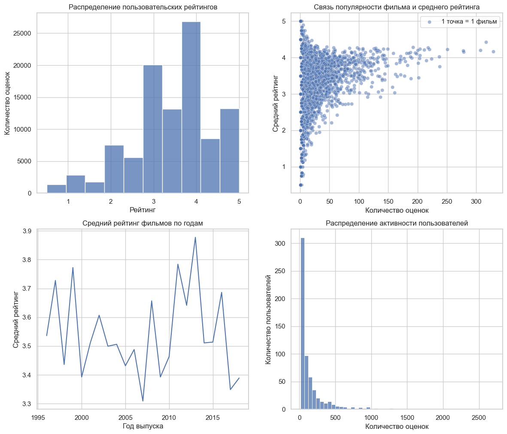

# MovieLens: анализ пользовательских оценок фильмов
Комплексный исследовательский анализ пользовательского поведения сервиса «MovieLens».

## О проекте

В данном проекте проводится исследование пользовательского поведения на основе датасета MovieLens.

Идея анализа возникла из наблюдения: 
некоторые фильмы получают очень высокие оценки, но имеют небольшое их количество, 
в то время как массовые фильмы собирают много оценок, но их рейтинг часто более умеренный.

Цель проекта - выявить закономерности в пользовательских оценках и понять, 
какие факторы влияют на формирование рейтингов.

## Основные вопросы

В рамках анализа исследуются следующие вопросы:

- Как распределены пользовательские оценки?
- Связана ли популярность фильма с его рейтингом?
- Какие жанры получают более высокие оценки?
- Как меняются оценки со временем?
- Как распределена активность пользователей?

## Используемые данные

Датасет: [**MovieLens**](https://www.kaggle.com/datasets/sengzhaotoo/movielens-small)

Который содержит:
- информацию о фильмах
- пользовательские оценки
- жанры
- временные метки

## Ключевые инсайты

1. Пользователи склонны ставить более высокие оценки
2. Популярность фильмов распределена крайне неравномерно
3. Около 6.8% фильмов аккумулируют 50% всех оценок, необходимо внедрение рекомендательных систем
4. Популярные фильмы имеют стабильные, но не максимальные рейтинги
5. Рейтинги «сглаживаются» при увеличении числа оценок
6. Нишевые жанры получают более высокие оценки за счёт вовлечённой аудитории
7. Массовые жанры имеют более умеренные рейтинги из-за разнообразия пользователей
8. Небольшая группа активных пользователей формирует значительную часть данных
9. Средний рейтинг остаётся стабильным во времени
10. Старые фильмы имеют завышенные оценки из-за "эффекта отбора"

## Дашборд по ключевым тезисам 

## Выводы

Пользовательские оценки формируются под влиянием:

- размера аудитории
- распределения внимания
- количества наблюдений
- особенностей пользовательского поведения

Для корректной интерпретации рейтингов важно учитывать не только среднее значение, 
но и количество оценок, популярность и структуру пользовательской активности.

## Используемые технологии

- Python 3.11+ — основной язык анализа данных  
- pandas — обработка и анализ табличных данных  
- matplotlib / seaborn — визуализация данных  
- Jupyter Notebook — проведение анализа и оформление исследования  
